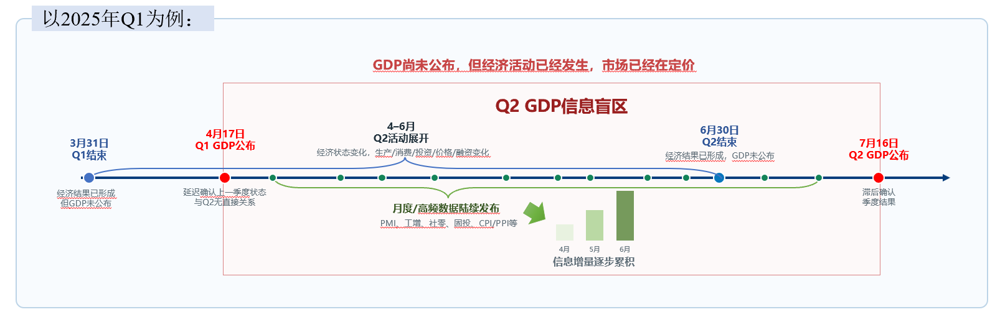
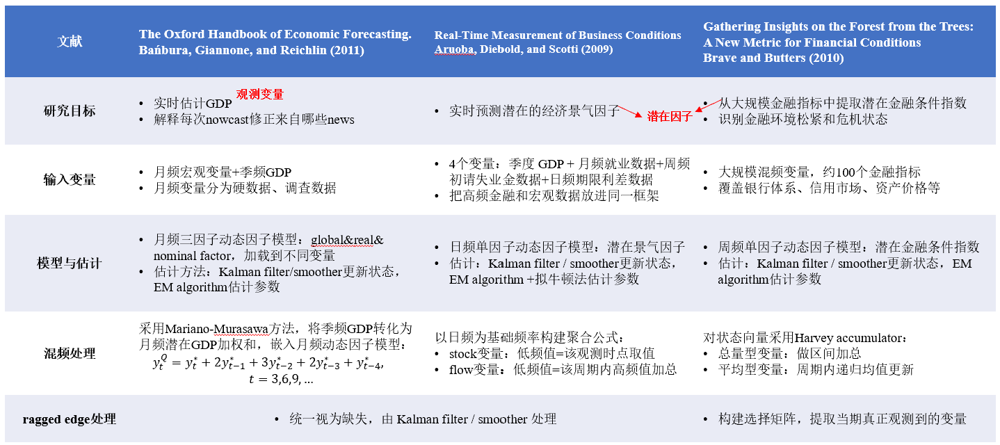
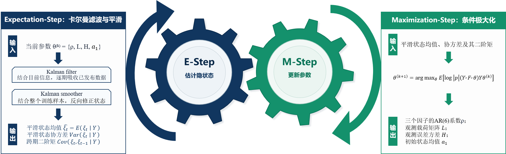

# 基于 Nowcasting 的 GDP 预测模型
本项目研究**季度 GDP 发布滞后**背景下的**实时增长判断**问题。

核心目标是利用更及时发布的**月频宏观数据**与更高频的**流动性信息**，构建**中国 GDP 不变价同比增速**的**月度 nowcasting 模型**，并检验这一按月更新的增长预期信号，是否能够**早于季度 GDP 公布**为债券市场提供更高频的交易判断依据。

方法上，项目采用**动态因子模型、状态空间框架与 Kalman filter** 实时更新机制，统一处理混频问题与样本末端信息不齐整问题，形成可持续更新的月度 GDP nowcasting 序列，并进一步映射为债券市场交易信号。

结果上，模型在训练期内能够较稳定地**拟合 GDP 走势**，样本外预测在**常态阶段**保持一定解释力。进一步地，在**中债-新综合净价 3-5 年指数和中债-新综合净价 5-7 年指数**上的 **IC、时间序列回归与分层检验**均表明，nowcasting GDP 与下一期债券净价收益之间存在方向一致的负向关系。交易层面，**增长明显走弱时做多债券**的单边信号相对更稳健，而增长明显走强时做空债券的效果较弱。

本项目的价值不在于替代官方 GDP，而在于将高频信息转化为**可跟踪、可检验、可交易映射**的增长预期指标。

## 1. 研究背景与问题

GDP 是宏观分析和资产定价的重要锚，但其发布频率低、披露时间滞后。季度已经结束而官方 GDP 尚未公布时，市场往往已经根据 PMI、工业增加值、社零、固投、价格和资金利率等高频信息重新定价，增长判断因此具有明显的实时性需求。


本项目目标是**利用与目标变量相关但统计频率更高且发布时间更及时的数据信息，来预测统计频率较低且发布存在显著滞后性的关键宏观经济变量**。

本项目聚焦三个问题：

1. 是否可以仅依赖月频宏观变量与高频流动性指标，对当期 GDP 同比进行稳定的实时预测。
2. 这一预测在训练期、样本外和季度内不同信息时点下的表现如何。
3. GDP nowcasting 信号是否能够转化为债券市场中可解释、可检验、可回测的收益预测信号。

## 2. 研究思路

项目的整体思路是：用高频信息弥补 GDP 发布滞后带来的信息盲区。


## 3. 文献基础与方法来源



本项目的建模逻辑主要借鉴以下三篇 nowcasting / 动态因子模型文献：

| 文献 | 本项目中的借鉴 |
| --- | --- |
| Bańbura, Giannone, and Reichlin (2011) | 借鉴其三因子设定，将月频宏观与流动性信息分为macro、nominal和real三大潜在因子。 |
| Aruoba, Diebold, and Scotti (2009) | 借鉴其对混频数据建模的基本思路，并在参数估计中引入拟牛顿法，对 EM 结果做进一步优化。 |
| Brave and Butters (2010) | 借鉴其 Harvey accumulator 思路处理季度 GDP 与月频状态之间的聚合关系；并结合选择矩阵，在样本末端信息不齐整时仅使用当期可观测数据完成状态更新。 |

文献在构建 Nowcasting 模型时主要聚焦于两个经典问题：

- `mixed frequency`：目标变量 GDP 是季频，而解释变量以月频甚至日频发布，必须建立频率聚合关系。
- `ragged edge`：不同指标发布时间不同，导致样本末端信息不齐整，不能简单强行补齐。

## 4. 项目结构与阅读路径

项目主体由数据准备、滚动窗口 nowcasting与债券回测三部分组成。当前主线目录如下：

| 路径 | 作用 |
| --- | --- |
| `01_data_preparation/1 data-processing gdp&macro data.ipynb` | 清洗原始宏观数据，生成统一月频底表 |
| `02_rolling_window_nowcasting/2005-2014窗口.ipynb` | 第一个 10 年训练窗的 nowcasting 主流程 |
| `02_rolling_window_nowcasting/*窗口.ipynb` | 12 个不同滚动训练窗口的 nowcasting 流程 |
| `02_rolling_window_nowcasting/滚动窗口模型效果汇总.ipynb` | 汇总滚动窗口训练期filter拟合、smoother 重构与样本外 nowcast |
| `02_rolling_window_nowcasting/滚动窗口模型效果汇总（去疫情期）.ipynb` | 去除疫情时期的汇总分析 |
| `03_bond_backtest/3 GDP_Bond_Backtest.ipynb` | 读取 nowcasting 结果并做债券信号检验与回测 |

## 5. 数据与变量设计

### 5.1 数据来源

主要原始数据来自 Wind，包含 GDP、宏观景气、生产、消费、投资、价格、就业以及资金利率数据。

### 5.2 变量准备

主线建模变量可概括如下：

| 变量 | 经济含义 | 建模处理 |
| --- | --- | --- |
| GDP 不变价当季值 | 目标变量 | 转换为中国 GDP 不变价同比增速（`GDP_yoy`） |
| 制造业 PMI、服务业 PMI | 景气 | 保留水平值 |
| 工业增加值同比、用电量同比 | 生产 | 直接保留同比口径 |
| 社零同比 | 消费 | 直接保留同比口径 |
| 固投累计值、固投累计同比 | 投资 | 累计值拆分为单月值后计算单月同比；累计同比口径同时保留 |
| CPI 同比、PPI 同比 | 价格 | 直接保留同比口径 |
| 城镇调查失业率 | 就业 | 构造一阶差分，形成失业率差分 |
| 逆回购利率:7天、银行间质押式回购加权利率:7天 | 流动性 | 月频化处理，分别取月末值和月区间均值 |

## 6. 数据预处理

数据预处理是模型表现的关键环节，核心步骤可概括如下：

| 步骤 | 目的 | 处理规则 |
| --- | --- | --- |
| 缺失值筛选 | 保证训练窗口内变量可用性 | 在训练窗口内计算覆盖率，剔除覆盖率低于 `0.8` 的解释变量，GDP 作为目标变量保留。 |
| 季节性检验与去季节性处理 | 避免季节波动干扰真实经济信号 | 对月份哑变量做联合 F 检验，若 `p < 0.05` 则视为存在显著季节性；保留趋势项和 AR(1) 项，仅剔除季节效应。 |
| 疫情异常值处理 | 降低异常阶段对参数估计的扭曲 | 对训练期内疫情冲击月份单独处理：`2020Q1` 与 `2022Q2` 处理所有变量，`2021Q1` 与 `2023Q2` 除 PMI 和失业率相关变量外其余变量处理；命中月份先置缺失，再在训练窗口内线性插值。 |
| 极端值缩尾 | 降低离群值干扰 | 对非疫情样本内各变量做 `1% / 99%` 分位数缩尾。 |
| 相关性去重 | 避免高相关同源变量重复入模 | 对相关系数高于 `0.9` 的变量对，保留缺失率更低、质量更稳定的一个。 |
| 标准化 | 统一变量尺度并保留可解释性 | 使用 `Z-score` 标准化，均值和标准差基于训练窗口计算，并保留反标准化参数。 |

## 7. 模型框架

### 7.1 三因子动态因子模型与状态空间表达

项目将月频宏观变量、流动性指标与季度 GDP 放入统一的动态因子框架，并以状态空间形式完成估计与实时更新。潜在公共因子设定为三个维度：`macro`、`real` 与 `nominal`。

#### (1) 动态因子模型

- 因子载荷方程 $x_t = \Lambda f_t + \varepsilon_t$

- 因子动态方程 $f_t = A_1 f_{t-1} + A_2 f_{t-2} + \cdots + A_6 f_{t-6} + u_t$

- 个体扰动方程 $\varepsilon_{i,t} = \alpha_i \varepsilon_{i,t-1} + e_{i,t}$

| 变量/参数 | 含义 |
| --- | --- |
| $x_t$ | 当期观测变量，包含月频宏观变量、流动性变量与季度 GDP 观测。 |
| $f_t$ | 三个潜在公共因子，分别刻画总体宏观、实体活动与名义环境。 |
| $\Lambda$ | 因子载荷矩阵，用于约束不同变量对不同因子的加载方式。 |
| $\varepsilon_t$ | 个体扰动项，捕捉公共因子之外的变量特异波动。 |

其中，三个潜在公共因子分别为：
- `macro`因子：表示所有月度宏观变量的共同波动，反映整体宏观景气。
- `real`因子：反映实体经济活动。
- `nominal`因子：反映价格与利率环境。

#### (2) 状态空间表达

动态因子模型刻画“**观测变量如何由少数潜在因子驱动**”，状态空间框架则将这一关系写成可估计、可递推更新的形式，从而实现对潜在经济状态的识别与实时预测。

- 状态向量 $\xi_t = (f_t, f_{t-1}, \ldots, f_{t-5}, S_t, M_t)'$

- 观测方程 $x_t = Z_t \xi_t + \varepsilon_t$，其中 $\varepsilon_t \sim N(0,H)$

- 状态转移方程 $\xi_t = T_t \xi_{t-1} + \eta_t$，其中 $\eta_t \sim N(0,Q)$

其中，$S_t$ 与 $M_t$ 分别表示混频处理引入的求和累加器与平均累加器状态：前者用于把月频潜在状态映射到季度 GDP 等流量观测，后者用于映射利率等存量或均值型观测。

#### (3) 因子加载规则

| 变量类别 | 加载规则 | 约束含义 |
| --- | --- | --- |
| 全部变量 | 加载 `macro` | 提取所有指标共享的总体宏观波动 |
| 流动性变量、CPI、PPI | 在 `macro` 基础上再加载 `nominal` | 刻画名义增长、价格与资金环境 |
| GDP、其余宏观活动变量 | 在 `macro` 基础上再加载 `real` | 刻画生产、消费、投资等实体活动变化 |

这一设定的目的，不是让所有变量自由加载全部因子，而是在识别上将“总体共振”“实体活动”“名义环境”区分开来，从而提高因子的经济解释性。由于本文使用的 GDP 指标为不变价同比增速，其反映的是实际产出变化而非名义价格变化，因此在因子加载设定中将其加载 `real` 因子而非 `nominal` 因子。

### 7.2 混频处理——Harvey 累加器

季度 GDP 与月频状态之间并不存在一一对应关系，因此项目使用 Harvey accumulator 将低频观测嵌入月频状态空间。在观测方程中，可将与累加器相关的载荷写成示意形式：

```math
x_t = Z_t \xi_t + \varepsilon_t, \qquad Z_t = [\Lambda_f \; \Lambda_S \; \Lambda_M]
```

其中，$\Lambda_S$ 对应求和累加器 $S_t$ 的观测载荷，主要服务于季度 GDP 等流量变量；$\Lambda_M$ 对应平均累加器 $M_t$ 的观测载荷，主要服务于利率等存量或均值型变量。

**（1）求和累加器**

对流量型变量，使用求和累加器：

```math
S_t = s_t S_{t-1} + \alpha_t
```

其中

```math
s_t = \begin{cases}
0, & \text{季度初} \\
1, & \text{非季度初}
\end{cases}
```

对应地，可写为分段递推：季度初 $S_t = \alpha_t$，非季度初 $S_t = S_{t-1} + \alpha_t$。

将累加器并入状态方程后，可写为：

```math
\begin{bmatrix}
\alpha_t \\
S_t
\end{bmatrix}
=
\begin{bmatrix}
\rho & 0 \\
\rho & s_t
\end{bmatrix}
\begin{bmatrix}
\alpha_{t-1} \\
S_{t-1}
\end{bmatrix}
+
\begin{bmatrix}
R \\
R
\end{bmatrix}
\eta_{t-1}
```

这一形式适用于**流量变量**，即一个季度的观测值由季度内多个高频值累加形成，如季度 GDP。

**（2）平均累加器**

对存量型变量，使用平均累加器：

```math
M_t = \frac{(m_t-1)M_{t-1}+\alpha_t}{m_t}
```

其中，$m_t$ 表示当期在该低频周期中的位置索引。以季度内月度平均为例：

```math
M_{q,1}=\frac{0+\alpha_t}{1}, \qquad
M_{q,2}=\frac{M_{t-1}+\alpha_t}{2}, \qquad
M_{q,3}=\frac{2M_{t-1}+\alpha_t}{3}
```

将平均累加器并入状态方程后，可写为：

```math
\begin{bmatrix}
\alpha_t \\
M_t
\end{bmatrix}
=
\begin{bmatrix}
\rho & 0 \\
\frac{\rho}{m_t} & \frac{m_t-1}{m_t}
\end{bmatrix}
\begin{bmatrix}
\alpha_{t-1} \\
M_{t-1}
\end{bmatrix}
+
\begin{bmatrix}
R \\
\frac{R}{m_t}
\end{bmatrix}
\eta_{t-1}
```

这一形式适用于**存量变量**，即数值主要由某一观察时点或周期平均决定的变量，如利率类指标。

### 7.3 缺失值处理——缺失值选择矩阵

为处理 `ragged edge`这一核心问题，项目不对样本末端未发布数据做机械补齐，而是根据当月真实可得信息构造选择矩阵 $W_t$，从完整观测向量中提取当期已发布变量。

设完整观测方程为 $y_t = Z_t \xi_t + \varepsilon_t$，其中 $\varepsilon_t \sim N(0, H_t)$。

在仅保留当期可观测变量后，可得到：

- 有效观测向量 $y_t^* = W_t y_t$
- 有效观测载荷矩阵 $Z_t^* = W_t Z_t$
- 有效观测误差协方差 $H_t^* = W_t H_t W_t'$

因此，Kalman filter 在每一期实际使用的是 $y_t^*$、$Z_t^*$ 与 $H_t^*$，从而保证 nowcasting 只依赖当期真实可获得的信息集。

## 8. 参数估计

### 8.1 PCA 初始化

由于潜在因子与载荷不可直接观测，项目先用 PCA 为三类公共因子提供稳定初值，再进入后续状态空间估计。

PCA 初始化遵循“总体因子优先、分类残差再分解”的思路：

1. 对全部月度变量做 PCA，第一主成分作为 `macro` 初值。
2. 从实体活动类变量中扣除 `macro` 已解释部分，再对残差做 PCA，得到 `real` 初值。
3. 从价格与利率类变量中扣除 `macro` 已解释部分，再对残差做 PCA，得到 `nominal` 初值。

在 `2005-2014` 训练窗口中，三类初始因子的第一主成分解释度约为：`macro` 45%、`real` 48%、`nominal` 47%。这一初始化方式的作用，是在进入 EM 之前先给出具有经济含义的因子起点，降低参数估计对随机初值的敏感性。

### 8.2 其他参数初始化

#### （1）初始化观测方程： $x_t = Z_t \xi_t + \varepsilon_t$，其中 $\varepsilon_t \sim N(0,H)$

- 月频变量在允许加载的因子集合上做无截距 OLS，直接求得**初始观测载荷矩阵**$Z_t$中的相应载荷系数，如 $\lambda_{ij}$。
- GDP 只在发布月参与观测，并由允许因子的季度累加器滞后项解释，因此对应的 **GDP 载荷**可写为：$y_t^{GDP} = \lambda_{GDP}' S_{t-1} + \varepsilon_t^{GDP}$。
- **观测误差协方差矩阵** $H$ 由观测方程回归残差的均方初始化，对角元素可记为 $h_i = \operatorname{Var}(\varepsilon_{i,t})$，并设置下限约束以避免数值不稳定。

#### （2）初始化状态转移方程： $\xi_t = T_t \xi_{t-1} + \eta_t$，其中 $\eta_t \sim N(0,Q)$

- 对每个 PCA 初始因子分别做无截距 `AR(6)` OLS，直接求得**状态转移矩阵** $T_t$中的 AR 系数，即 $f_t = \rho_1 f_{t-1} + \rho_2 f_{t-2} + \cdots + \rho_6 f_{t-6} + u_t$。
- 在得到 AR 系数后，进一步构造 Kalman filter 所需的初始**状态均值**$\mathbb{E}(\xi_0)$与**状态协方差矩阵**$\operatorname{Var}(\xi_0)$ 。

### 8.3 EM 迭代与 Quasi-Newton 微调

#### （1）EM 迭代

EM 迭代以上一步得到的初始值为输入，在 E-step 与 M-step 之间交替更新参数。

- **E-step**：在给定当前参数 $\theta^{(k)} = \{\rho, L, H, a_1\}$ 的条件下，利用 Kalman filter 与 smoother 计算隐状态的条件期望、协方差及相关二阶矩。
- **M-step**：在 E-step 输出的基础上，条件极大化期望对数似然并更新参数 $\theta = \{\rho, L, H, a_1\}$，即 $\theta^{(k+1)} = \arg\max_{\theta} E\left[\log p(Y,F;\theta)\mid Y,\theta^{(k)}\right]$。
- **收敛标准**：以相对对数似然变化衡量，定义为$
\mathrm{rel\_change} = \frac{|\ell^{(k)}-\ell^{(k-1)}|}{\max(1,|\ell^{(k-1)}|)} < 10^{-4}$




#### （2）Quasi-Newton 微调

在 EM 收敛后，再使用 Quasi-Newton 做局部微调，以进一步提高参数估计的稳定性。

- QN 阶段固定观测载荷矩阵 $L$、观测误差方差矩阵 $H$ 和初始状态均值 $a_1$，仅优化三个因子的 AR(6) 系数 $\rho$。优化目标仍为 Kalman log likelihood。
- **收敛标准**：当相对对数似然变化满足$
\frac{|\ell^{(k)}-\ell^{(k-1)}|}{\max(1,|\ell^{(k-1)}|)} < 10^{-6}$，且连续满足 5 次时，停止 QN 迭代。

## 9. 实时更新机制

模型上线后的实时更新流程如下；其中，只有当新数据相对模型先验产生偏差时，状态与 GDP 预测才会被修正。


对应的实时更新可分为“初始设定”与“新数据触发后的循环更新”两部分：

1. **初始设定**：模型上线时沿用训练阶段估计参数，并初始化状态均值与状态协方差。

2. **新数据到来前，先做先验预测**：根据上一期状态形成本期先验预测
   - 当前状态期望 $a_t^- = T a_{t-1}$
   - 当前状态方差 $P_t^- = T P_{t-1} T' + Q$。

3. **新数据到来后，做卡尔曼更新**：
   - 先由选择矩阵构造有效观测集
   - 计算预测误差 News：$v_t = x_t - Z_t a_t^-$
   - 更新误差协方差 $F_t = Z_t - P_t^- Z_t' + H_t$
   - 计算卡尔曼增益 $K_t = P_t^- Z_t' F_t^{-1}$
   - 状态更新 $a_t = a_t^- + K_t v_t$。

4. **输出当期 nowcasting**：在更新后的状态基础上递推累加器，并根据观测载荷关系得到新的 GDP 预测，再反标准化为 GDP 同比。

综上，核心修正关系可写为：

```math
\underbrace{\hat{GDP}_{q\mid t}^{std,new}-\hat{GDP}_{q\mid t}^{std,old}}_{\text{GDP预测修正}}
=
\underbrace{Z_{GDP}K_t}_{\text{新数据对GDP的更新权重}} \times \underbrace{\left(x_t-Z_t a_{t\mid t-1}\right)}_{\text{新数据的意外成分News}}
```

### 9.1 月度信息集与交易执行时点

除模型结构本身外，项目还对每个月的观测截止日、模型运行时点和交易持有区间做了明确设定。按图示规则，可以把一次 `t` 月 GDP nowcasting 与债券交易信号更新理解为以下流程：


1. `t` 月结束后，进入对 `t` 月经济状态的事后信息补齐阶段。
2. 在 `t+1` 月 `19` 日之前，持续观察与 `t` 月有关的宏观数据发布和修订，更新当期可用信息集。
3. 在 `t+1` 月 `19` 日运行 nowcasting 模型，利用截至该日可得的数据，更新对 `t` 月 GDP 的预测值。
4. 在 `t+1` 月 `20` 日或之后的第一个交易日，根据最新 GDP nowcasting 信号开仓。
5. 持有至 `t+2` 月 `19` 日前最后一个交易日，再进入下一轮信号更新。

这一设定的含义是：模型预测并不是在月末立即生成，而是允许月度宏观数据在次月上半月继续补齐；交易信号也不是在数据发布日期当天追单，而是在固定观测窗口结束后统一更新、统一执行。这样做有两个好处：

- 保证 nowcasting 使用的信息集与真实可得数据时点一致，避免把更晚披露的信息提前带入。
- 让债券回测中的信号生成、开仓和持有周期保持规则化，便于和月度收益口径对应。

## 10. 滚动窗口设计

项目采用固定长度 10 年训练窗口，逐窗训练并预测下一年 GDP。

- 第一个窗口是 `2005-2014`
- 之后依次向前滚动
- 当前仓库覆盖到 `2016-2025`

这种设计的目的是在保证样本量的同时，尽量让参数估计反映更接近当期制度和经济结构的关系。

## 11. 模型输出

主流程有两类核心输出：

### 11.1 GDP nowcasting 输出

- 月度 GDP nowcasting 值
- 训练期 Kalman filter 拟合值
- 训练期 Kalman smoother 重构值
- 滚动窗口样本外预测结果

### 11.2 债券市场信号输出

- 以 GDP 预测边际变化构造增长预期信号
- 与中债指数下月收益做 IC、回归、分层和阈值交易检验

## 12. 实证结果

### 12.1 训练期内拟合结果

PPT 中给出的样本内结果基于各十年训练窗口内部样本，真实 GDP 以季度值向前填充为月频，并剔除了疫情影响期。

总体结果如下：

| 口径 | `n_obs` | `MAE` | `RMSE` | `Corr` |
| --- | ---: | ---: | ---: | ---: |
| Kalman filter monthly fit | 1266 | 0.3828 | 0.5245 | 0.9680 |
| Kalman smoother reconstruction | 1266 | 0.2059 | 0.2909 | 0.9902 |

这说明：

- 模型在训练期内能够较稳定地抓住 GDP 与宏观变量的共同波动。
- smoother 重构明显优于 filter 口径，说明全样本平滑后的潜在状态识别较强。

### 12.2 样本外 nowcasting 结果

PPT 给出的样本外总结果为：

| 样本 | `Mean Error` | `MAE` | `RMSE` | `Corr` |
| --- | ---: | ---: | ---: | ---: |
| All | 0.0101 | 0.7538 | 1.5191 | 0.7211 |

按年份拆分可见：

- `2015`、`2016`、`2018`、`2019`、`2024`、`2025` 表现相对稳定。
- `2020` 和 `2021` 误差明显放大，反映疫情冲击阶段结构异常对模型的破坏。
- `2022` 和 `2023` 有所修复，但仍带有异常期后的结构调整影响。

因此，样本外结果的核心结论是：模型在常态阶段更有效，在疫情及后疫情阶段更容易失真。

### 12.3 季度内月份差异

季度内信息逐步补齐后，预测效果明显改善。PPT 中给出的统计为：

| 季度内月份顺序 | `Mean Error` | `MAE` | `RMSE` | `Corr` |
| --- | ---: | ---: | ---: | ---: |
| 第 1 个月 | 0.0856 | 1.0546 | 2.0686 | 0.6805 |
| 第 2 个月 | -0.0671 | 0.7267 | 1.3890 | 0.7427 |
| 第 3 个月 | 0.0119 | 0.4802 | 0.8452 | 0.8384 |

这说明 nowcasting 的价值更像“随数据披露不断更新的实时跟踪工具”，而不是季度初就能给出高精度远距离预测的静态模型。

### 12.4 方向预测准确率

若以上一期真实 GDP 为基准，将本期增长方向分为上修与下修两类，则：

| 样本 | 方向准确率 |
| --- | ---: |
| 全样本 | 81.13% |
| 第 1 个月 | 60.00% |
| 第 2 个月 | 83.33% |
| 第 3 个月 | 95.00% |

同时，PPT 还给出了一个重要现象：

- 当 `|Signal_t| > 0.2` 时，可视作更明确的增长变化。
- 变化幅度越大，方向预测准确率越高。

因此，模型对“方向”尤其是“明显变化方向”的识别，强于对精确幅度的预测。

## 13. 债券市场信号检验

### 13.1 检验对象

PPT 使用中债相关净价指数作为交易标的，样本覆盖公开发行、可流通的国债、政策性金融债、银行债、企业债、公司债等，剔除 ABS、美元债、可转债及私募 / 定向债。

经济逻辑很直接：

- GDP 上修
- 增长预期改善
- 利率上行压力增加
- 债券价格承压
- 下一期债券净价收益偏弱

### 13.2 IC 检验

PPT 中代表性结果如下：

| 标的 | 信号 | IC | Rank IC | 36M ICIR |
| --- | --- | ---: | ---: | ---: |
| 中债-新综合净价(3-5年)指数 | `nowcasting_GDP` | -0.1167 | -0.0381 | -0.2964 |
| 中债-新综合净价(3-5年)指数 | `actual_gdp_yoy` | -0.3045 | -0.1364 | -0.9435 |
| 中债-新综合净价(5-7年)指数 | `nowcasting_GDP` | -0.0934 | 0.0143 | -0.0872 |
| 中债-新综合净价(5-7年)指数 | `actual_gdp_yoy` | -0.2793 | -0.1258 | -0.9679 |

可得三点判断：

- IC 为负，说明 GDP 上修通常对应下一月债券净价收益走弱。
- nowcasting 信号方向是对的，但强度弱于真实 GDP。
- `3-5` 年期限桶通常比 `5-7` 年对 GDP 信号更敏感。

### 13.3 时间序列回归

PPT 展示的代表性回归结果如下：

| 标的 | 信号 | `beta` | `t_stat` | `p_value` | `adj_r2` |
| --- | --- | ---: | ---: | ---: | ---: |
| 中债-新综合净价(3-5年)指数 | `nowcasting_GDP` | -0.0002 | -1.6705 | 0.0948 | 0.1077 |
| 中债-新综合净价(3-5年)指数 | `actual_gdp_yoy` | -0.0003 | -2.1994 | 0.0278 | 0.1282 |
| 中债-新综合净价(5-7年)指数 | `nowcasting_GDP` | -0.0003 | -1.4857 | 0.1374 | 0.1172 |
| 中债-新综合净价(5-7年)指数 | `actual_gdp_yoy` | -0.0004 | -2.4754 | 0.0133 | 0.1470 |

这说明：

- nowcasting 信号对债券收益具有负向解释方向。
- 但统计强度有限，更多体现为边际显著或不显著。
- 真实 GDP 信号仍明显强于 nowcasting 信号。

### 13.4 分层检验

项目先构造月度 GDP 信号，再按信号强弱分成 `3` 组或 `5` 组，比较最高组与最低组下月债券收益的差异。

PPT 的总结是：

- `3` 分组过粗，容易受少量错估月份干扰。
- `5` 分组更细，高信号月份的债券收益整体低于低信号月份。

换言之，增长越强的月份，债券未来一个月的净价表现通常越弱，方向上符合宏观逻辑。

### 13.5 单边阈值交易

PPT 对交易层面的结论非常明确：

- “增长明显走弱时做多债券”有效。
- “增长明显走强时做空债券”效果弱，且容易受到市场约束和噪声干扰。

因此，`nowcasting GDP` 更适合作为：

- 单边做多债券的择时信号

而不是：

- 对称的多空交易信号

其含义是，当前模型更适合用于“弱增长防御”识别，而不是直接把强增长信号机械映射成债券空头仓位。

下图对应 PPT 中“单边阈值交易”页的两张阈值-夏普曲线：

弱增长做多债券：


强增长做空债券：


## 14. 项目结论

结合 PPT 和当前仓库结果，可以归纳出三条主结论。

### 14.1 DFM + 状态空间框架适合做 GDP nowcasting

该框架能够统一处理：

- 混频问题
- 缺失值与 ragged edge
- 数据异步发布
- 数据发布后的连续实时更新

### 14.2 模型表现高度依赖数据工程

实际结果对以下环节都比较敏感：

- 季节性处理
- 同源变量去重
- 疫情异常期平滑
- AR 阶数设定
- 观测误差下限约束

### 14.3 nowcasting 信号对债券有解释力，但稳定性有限

- 幅度预测能力一般，方向分类更强。
- 越接近季度末，预测越准。
- 增长明显走弱时做多债券更稳。
- 真实 GDP 仍强于 nowcasting GDP，说明市场映射层仍有优化空间。

## 15. 后续优化方向

PPT 中给出的后续优化方向包括：

- 扩展更及时的价格、交易、资金面和流动性指标，并构建发布日期日历。
- 优化 `nominal` 因子，增加价格与名义变量，降低对 CPI / PPI 的单一依赖。
- 更精细地建模宏观数据初值、修正值和最终值之间的数据修订过程。
- 将 GDP 信号与资金面、政策预期、期限利差联合使用，而不是单变量触发交易。
- 对债券空头方向增加更高阈值、尾部风险过滤、事件月份剔除或仓位控制。

## 16. 核心 Notebook 与结果位置

项目的主要研究流程和结果查看入口如下：

1. `01_data_preparation/1 data-processing gdp&macro data.ipynb`
   负责清洗 GDP 与宏观原始数据，生成统一月频底表，是后续建模的输入基础。
2. `02_rolling_window_nowcasting/2005-2014窗口.ipynb`
   展示第一个 10 年训练窗口下的 nowcasting 主流程，包含变量处理、模型估计、训练期拟合与样本外预测。
3. `02_rolling_window_nowcasting/*窗口.ipynb`
   对不同训练窗口重复同一建模框架，用于考察参数与预测效果在时间上的稳定性。
4. `02_rolling_window_nowcasting/滚动窗口模型效果汇总.ipynb`
   汇总各滚动窗口的训练期拟合、smoother 重构与样本外 nowcast，是查看模型总体表现的核心 notebook。
5. `02_rolling_window_nowcasting/滚动窗口模型效果汇总（去疫情期）.ipynb`
   用于在剔除疫情异常阶段后，重新观察模型在常态样本中的表现。
6. `03_bond_backtest/3 GDP_Bond_Backtest.ipynb`
   读取 nowcasting 结果并构造债券市场信号，完成拟合优度、方向准确率、IC、回归、分层和阈值交易检验。

## 17. 关键结果位置

若仅关注最终结果，优先查看以下输出文件：

- `02_rolling_window_nowcasting/汇总结果/filter_monthly_overall_metrics.csv`
- `02_rolling_window_nowcasting/汇总结果/smoother_monthly_overall_metrics.csv`
- `02_rolling_window_nowcasting/汇总结果/nowcast_monthly_overall_metrics.csv`
- `02_rolling_window_nowcasting/汇总结果/nowcast_monthly_by_horizon_0_2_metrics.csv`
- `02_rolling_window_nowcasting/汇总结果/nowcast_monthly_stitched_backtest.csv`
- `03_bond_backtest/汇总结果/02-拟合优度/02_gdp_fit_metrics.csv`
- `03_bond_backtest/汇总结果/03-方向准确率/03_gdp_direction_accuracy.csv`
- `03_bond_backtest/汇总结果/04-IC分析/04_nowcasting_lag1_actual_ic_summary_by_bond.csv`
- `03_bond_backtest/汇总结果/05-时间序列回归/05_ts_regression_results_by_bond_lag1_actual.csv`
- `03_bond_backtest/汇总结果/07-分层检测/07_long_short_high_minus_low_next1m_lag1_actual.csv`
- `03_bond_backtest/汇总结果/08-阈值交易探索/08_threshold_strategy_best_by_duration_lag1_actual.csv`

这些文件分别对应模型训练期拟合、样本外 nowcasting 误差、季度内 horizon 表现，以及债券市场中的方向识别、收益相关性、时间序列回归和阈值交易结果。

## 18. 补充说明与后续展示重点

仓库中的路径说明、原始数据与中产物说明，见：

- `00_docs/项目文件说明.md`
- `AGENTS.md`

如果后续继续扩展 README，最值得进一步补充的部分包括：

- 各滚动窗口下的因子载荷稳定性与参数稳定性
- 疫情期、后疫情期与常态期的分段误差归因
